For colorisating without input, go to colorisation directory and run the following commands as per use: 
  1) For coloring a gray-scale image 
    `python colorize.py -img_in rose.jpeg -img_out rose_out.jpeg` 
  2) For coloring multiple photos, put them in inputs directory. Run the folowing command and the colorised photos will be put in outputs directory: 
     `python colorImages.py --pathIn inputs/ --pathOut outputs/` 
  3) For coloring a video, go to the colorisation directory  
    `python videoColorizer.py --pathIn dog.mp4 --pathOut ""`   
    
### The inputs folder contains some iconic grayscale images, outputs folder contains the colorised version as produced by model. 
 
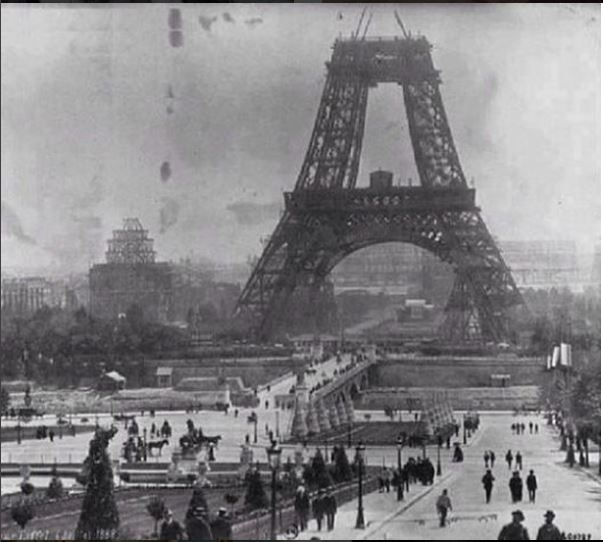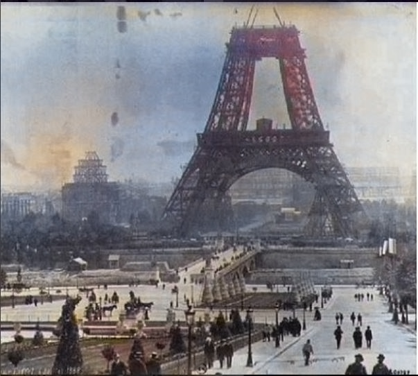 
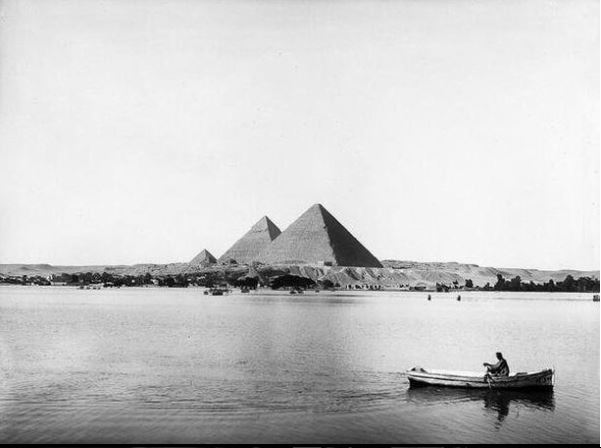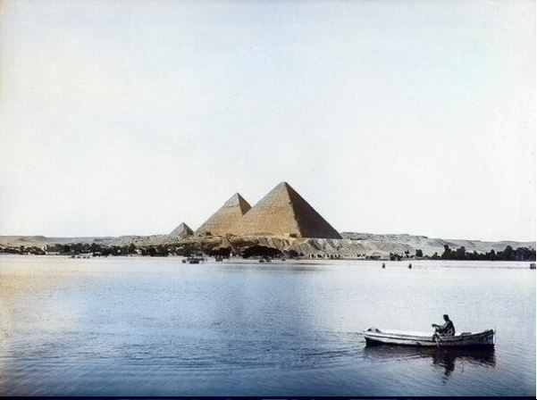 
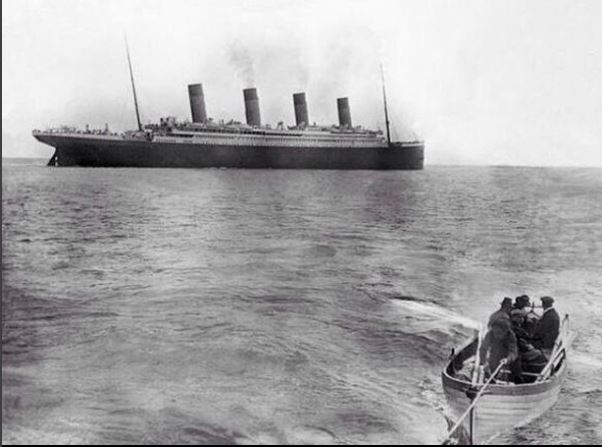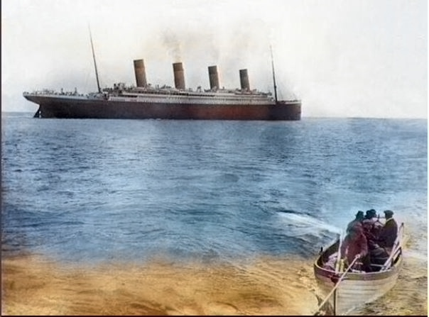 

### Some examples of colorisation as produced by the model are  
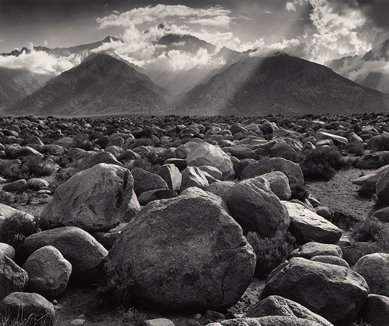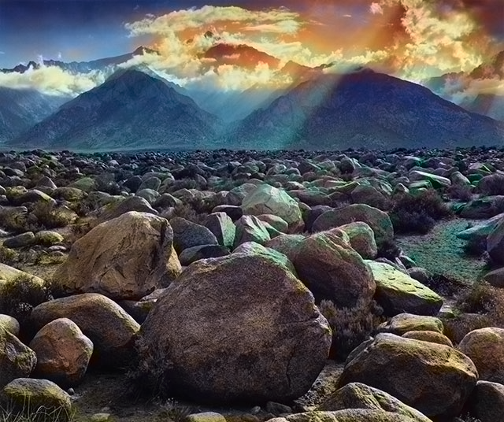 

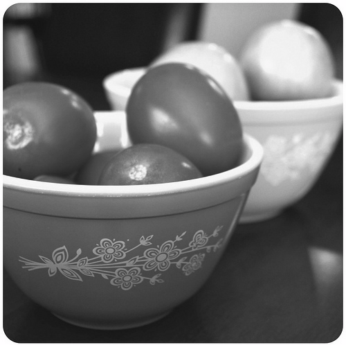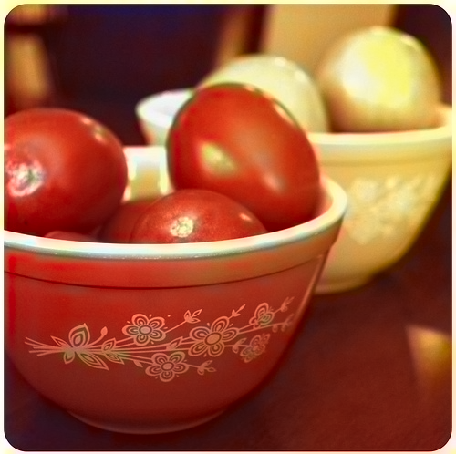 

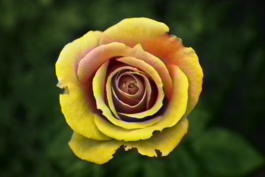 

 
